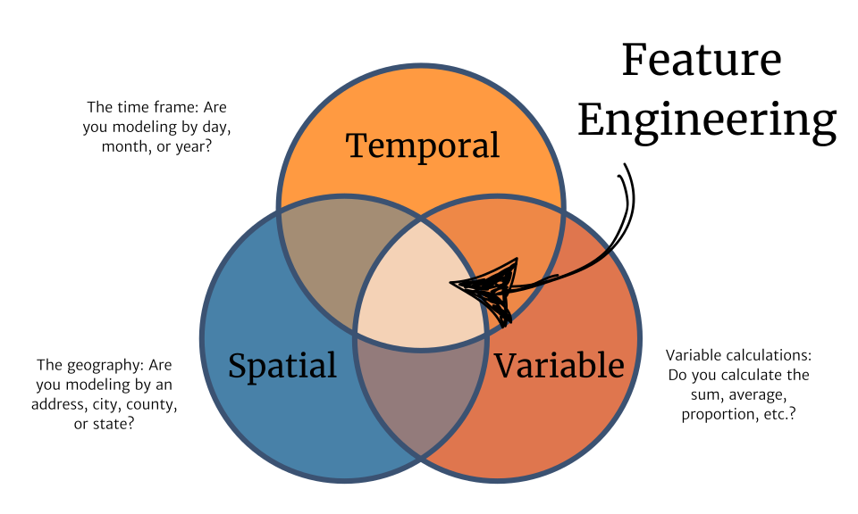
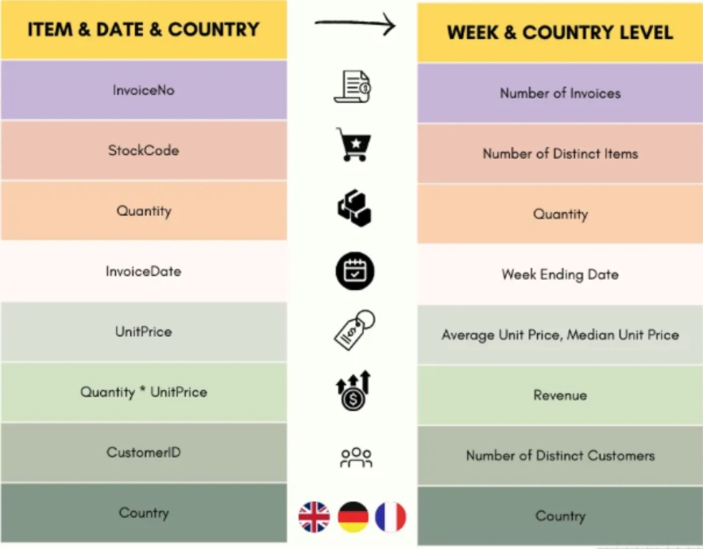
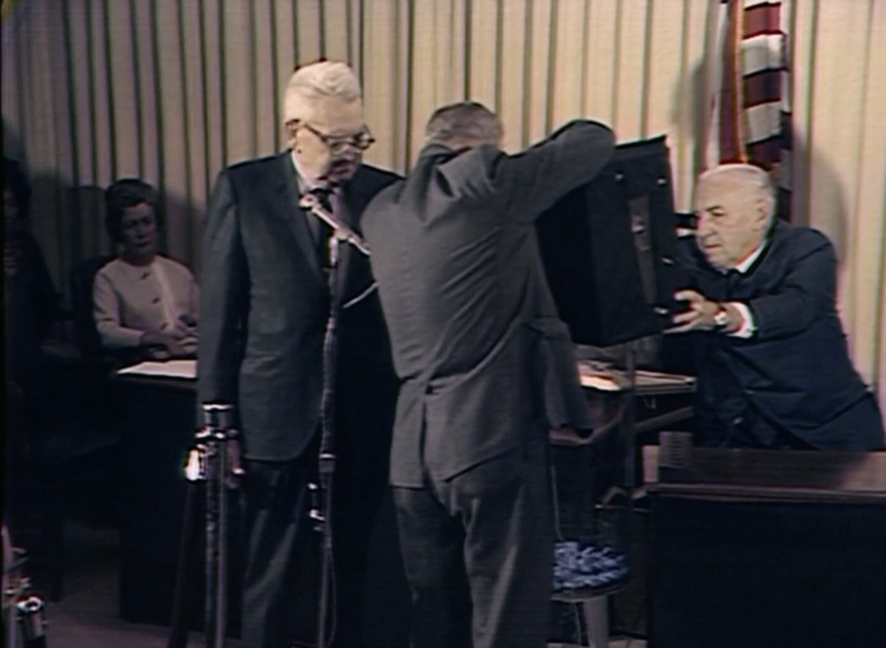
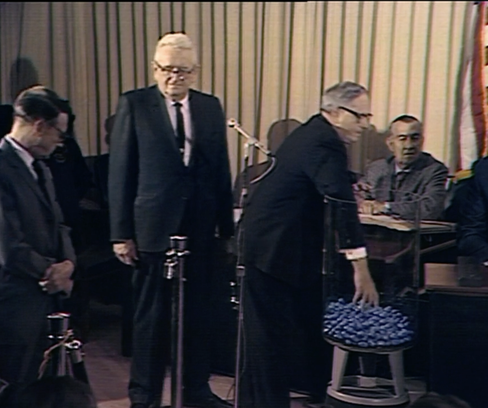

# Feature Engineering

When working with business data, we often have a database that stores transactions. We will have tables that store credit card transactions, tables that store paycheck transactions, key card tables that store build access transactions, and account tables that store logins or purchase transactions. These transaction tables are usually not at the right level of detail (often called _'unit of analysis'_) for any machine learning or statistical model inference. 

To build our predictive models, these transaction tables need to be munged into the correct space, time, and variable aggregation. Here are the questions we must work through based on our modeling needs.

- What is my spatial unit of interest for predictions? How can I munge my tables to create the foundation of the analysis table?
- What is my label/target that I will use for prediction?
- What features would help predict my label?
- What is my temporal unit of interest for feature building?
- What tables/keys do I need to map my transactions to that spatial unit?

Soyoung L[^3] shared the following image in her Medium post on feature engineering. Notice the examples of moving from transaction data to the _unit of analysis_ level of data that we would use in our modeling.

While there is a lot of engineering when building features for models.  There is also a lot of art.

> Feature engineering is more of an art than a formal process. You need to know the domain you're working with to come up with reasonable features. If you're trying to predict credit card fraud, for example, study the most common fraud schemes, the main vulnerabilities in the credit card system, which behaviors are considered suspicious in an online transaction, etc. Then, look for data to represent those features, and test which combinations of features lead to the best results.[^1]

All feature engineering must account for all three elements shown in the above ven-diagram. However, many data engineering problems often come with implicit temporal and spatial aggregations built into the data. For example, the [NBA Players data](https://posit.byui.edu/connect/#/apps/79f02394-0601-42f4-afd2-3e7becfe79f8/access) is an example of a dataset that provides all three elements. We could use the `college`, `tm`, and `birth_state` as potential spatial aggregators. We have `year`, `born`, and `age` as potential temporal aggregators. Finally, there are multiple other variables we could use at the variable level.

Many of the datasets you see in introductory courses often provide tabular data that is summarized at a certain space and time.  The following list highlights some examples.

- [Old Faithful data](https://posit.byui.edu/connect/#/apps/bffff7df-8f54-4b08-bd9d-b1e26ca5257e/access): In this example, we are left with two variables and implicit spatial element (by the name of the file) and a missing temporal element.
- [Singer heights](https://posit.byui.edu/connect/#/apps/a420dd88-30ba-4744-af9b-26cba9b37763/access): We have no information about space or time with this data.
- [Gharial Crocodiles](https://posit.byui.edu/connect/#/apps/307eff8d-b659-4371-a3e2-c4ec690f0adf/access): We have no information about space or time with this data.
- [Vietnam Draft](https://posit.byui.edu/connect/#/apps/4d8cbf4c-5d5c-4108-b477-1e91f1d45d86/access): We have a bit of temporal information but no spatial information. In this example, the spatial information wouldn't be a place on a map.  It would be great to have the location of the ping pong ball in the cylinder before it is selected ([See Wikepedia](https://en.wikipedia.org/wiki/Vietnam_War_draft)).

Generally, we must do quite a bit of feature engineering when we start with transactional data. In the brief examples below, we will leverage less complex data.

## Space based

The 1969 US Vietnam Draft created many emotions in the young men that had their birthdays drawn. Especially those that had their birthdates drawn early. From a New York Times article in that period[^3] we read.

> They started out with 366 cylindrical capsules, one and a half inches long and one inch in diameter. The caps at the ends were round. The men counted out 31 capsules and inserted in them slips of paper with the January dates. The January capsules were then placed in a large, square wooden box and pushed to one side with a cardboard divider, leaving part of the box empty. The 29 February capsules were then poured in to the empty portion of the box, counted again, and then scraped with the divider into the January capsules. The same process was followed with each subsequent month, counting the capsules into the empty side of the box and then pushing them with the divider into the capsules of the previous months. Thus, the January capsules were mixed with the other capsules 11 times, the February capsules 10 times and so on, with the November capsules intermingled with others only twice and the December ones only once.

In @fig-draft we see the pouring of the capsules from the box and how the capsules were then selected from the large beaker. 

::: {#fig-draft layout-ncol=2}

{.lightbox}

{.lightbox}

1969 Vietnam Draft Lottery Images[^4]
:::

It would be great if we could have geolocated each capsule within the beaker

## Variable based 

See images from class

## Time based

See images from class

[^1]: [Tutorial: Feature Engineering for Time Series Forecasting in PySpark | by Soyoung L | Medium](https://medium.com/@soyoungluna/tutorial-feature-engineering-for-weekly-time-series-forecasting-in-pyspark-b207c41869f4)
[^2]: [How to create useful features for Machine Learning](https://www.dataschool.io/introduction-to-feature-engineering/)
[^3]: [Statisticians Charge Draft Lotter'y Was Not Random - The New York Times](https://www.nytimes.com/1970/01/04/archives/statisticians-charge-draft-lottery-was-not-random.html)
[^4]: [Almanac: The 1969 draft lottery - CBS News](https://www.cbsnews.com/amp/news/almanac-the-1969-draft-lottery-vietnam-war/), [The 1969 Draft Lottery (Vietnam War) - YouTube](https://www.youtube.com/watch?v=gl29gRRppBg), and [HD Stock Video Footage - The Selective Service System (SSS) holds a draft lottery to induct men into the Vietnam War.](https://www.criticalpast.com/video/65675036675_Selective-Service-System_lottery-selection_man-draws-random-number_display-board)