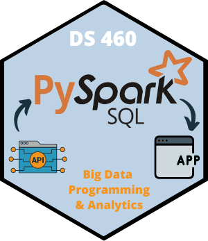

## Where the brand lives

All decks in `slides/` pick this up automatically.

| File | What it controls |
|------|------------------|
| `_brand.yml` | Colors, fonts, logos |
| `ds460.scss` | Heading rule, title slide, code, helper classes |
| `_quarto.yml` | Logo, footer, slide numbers, transitions |

Start a new deck by copying `example.qmd`. There's no theme to set per deck.

## Source artwork

{width=100%}

The palette is sampled from the banner photo and the hex badge. Fonts match the banner's monospaced title and the badge's rounded sans.

## Color palette

::: {.swatches}
::: {.swatch}
[&nbsp;]{.chip style="background:#022F4A"}
**Summit Navy**<br>`#022F4A`<br>[headings, dark slides]{.muted}
:::

::: {.swatch}
[&nbsp;]{.chip style="background:#426A8A"}
**Ridge Blue**<br>`#426A8A`<br>[links, h3, footer]{.muted}
:::

::: {.swatch}
[&nbsp;]{.chip style="background:#263D46"}
**Slate**<br>`#263D46`<br>[inline code]{.muted}
:::

::: {.swatch}
[&nbsp;]{.chip style="background:#4D93AC"}
**Teal**<br>`#4D93AC`<br>[cards, info]{.muted}
:::

::: {.swatch}
[&nbsp;]{.chip style="background:#BDD3E5"}
**Sky Ice**<br>`#BDD3E5`<br>[hex fill, soft text]{.muted}
:::

::: {.swatch}
[&nbsp;]{.chip style="background:#D2DADB"}
**Mist**<br>`#D2DADB`<br>[dividers]{.muted}
:::

::: {.swatch}
[&nbsp;]{.chip style="background:#F4F7F9;outline:1px solid #D2DADB"}
**Cloud**<br>`#F4F7F9`<br>[code, cards]{.muted}
:::

::: {.swatch}
[&nbsp;]{.chip style="background:#D5773C"}
**Spark Orange**<br>`#D5773C`<br>[code rule, stats]{.muted}
:::

::: {.swatch}
[&nbsp;]{.chip style="background:#F59625"}
**Course Orange**<br>`#F59625`<br>[accents, subtitle]{.muted}
:::

::: {.swatch}
[&nbsp;]{.chip style="background:#111111"}
**Ink**<br>`#111111`<br>[body text]{.muted}
:::
:::

## Color rules

- **Navy carries the structure:** headings, the title slide, table headers.
- **Orange is the accent.** Use it once or twice per slide, never for body text.
- **Teal and ridge blue** are for secondary information.
- Light slides use white. Save navy backgrounds for emphasis.

Text helpers: [.navy]{.navy} · [.orange]{.orange} · [.spark]{.spark} · [.teal]{.teal} · [.muted]{.muted}

```markdown
Spark is [lazy]{.orange} until an action runs.
```

## Typography

::: {.columns}
::: {.column width="50%"}
### Headings: Fira Code

[Big Data]{style="font-family:'Fira Code';font-size:1.3em;font-weight:600;color:#022F4A"}

Monospaced, like the banner. Keep headings short so they fit on one line.
:::
::: {.column width="50%"}
### Body: Open Sans

[Readable at the back of the room.]{style="font-size:1.1em"}

Sans serif for bullets and prose. Code also uses Fira Code, so headings and code look alike.
:::
:::

## Code

```python
from pyspark.sql import functions as F

(spark.table("games")
    .groupBy("team")
    .agg(F.avg("points").alias("avg_points"))
    .orderBy(F.desc("avg_points")))
```

Code blocks use a light surface and a Spark Orange rule. Inline `code` uses slate on cloud.

## Cards and stats

::: {.columns}
::: {.column width="33%"}
::: {.card}
[2.5 PB]{.stat}
Ingested per day
:::
:::
::: {.column width="33%"}
::: {.card}
[200×]{.stat}
Faster than pandas
:::
:::
::: {.column width="33%"}
::: {.card}
[1]{.stat}
Line to scale out
:::
:::
:::

```markdown
::: {.card}
[Card title]{.card-title}

[2.5 PB]{.stat}
:::
```

Use `[Title]{.card-title}`, not `###`. A heading at the start of a div becomes its own slide.

## Takeaways

::: {.takeaway}
**Key idea:** transformations build a plan; actions run it.
:::

<br>

```markdown
::: {.takeaway}
**Key idea:** transformations build a plan; actions run it.
:::
```

Use one takeaway per slide at most, usually at the end of a topic.

# Section slides

Use a level-1 heading (`# Name`) to start a new part of the lecture.

## Dark slides {.dark background-color="#022F4A"}

Use a dark slide for a question to the class, a pause, or a big idea.

```markdown
## Discuss {.dark background-color="#022F4A"}
```

[Use no more than one or two per lecture.]{.orange}

## Tables

| Tool | Scale | Language |
|------|-------|----------|
| pandas | One machine | Python |
| Polars | One machine | Python / Rust |
| PySpark | Cluster | Python / SQL |
| Databricks SQL | Cluster | SQL |

Tables get a navy header row and light striping.

## Logos

::: {.columns}
::: {.column width="30%"}
{width=80%}
:::
::: {.column width="70%"}
- **Hex badge** (`DS460_Hex.png`) goes in the slide corner and on the title slide. That's set up for every deck.
- **Banner** (`DS460_Banner.png`) is for the course site and syllabus headers. It's too wide for a slide.
- Don't recolor, stretch, or crop either logo.
:::
:::
