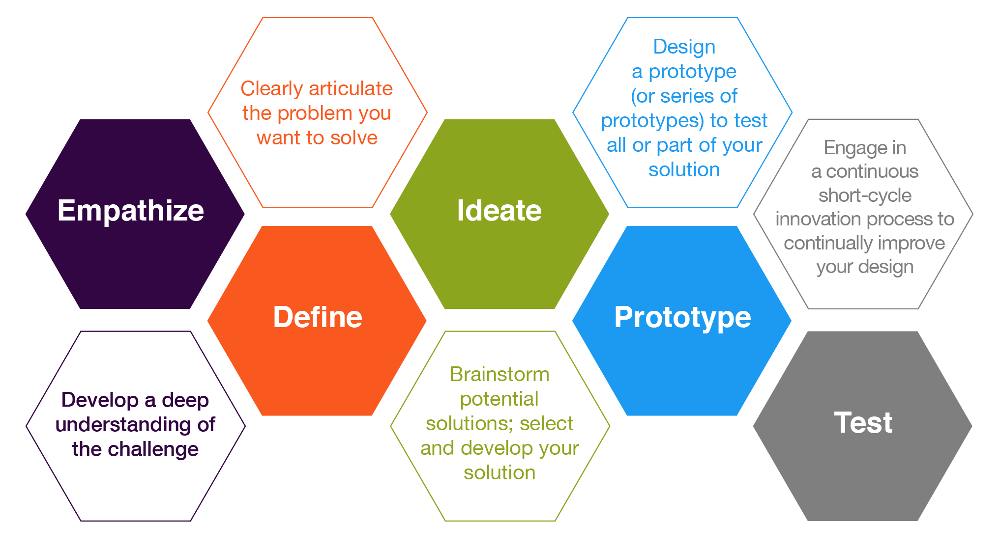
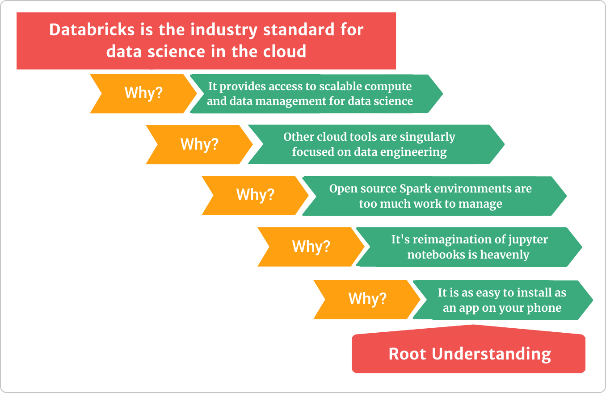

## Today

1. What you'll be able to do by the end of the semester
2. How the class runs: like a start-up, not a lecture
3. How you'll learn: on purpose, with some confusion
4. How you're graded: four competencies and a letter
5. What to do this week

::: {.notes}
Everything here comes from the course guide: github.com/byuibigdata/course_guide
:::

# Why this course

## By the end of the semester, you'll be able to

::: {.incremental}
1. **Explore and interpret** distributed data at scale in business contexts, using Databricks and PySpark.
2. **Implement the pipeline**, from API ingestion through feature engineering to a containerized app.
3. **Present data-informed arguments** for technical team decisions.
4. **Identify the differences and benefits** of current industry tools for big data storage and analysis.
:::

## The tools

::: {.columns}
::: {.column width="33%"}
::: {.card}
[Data]{.card-title}

Polars PySpark Spark SQL
:::
:::
::: {.column width="33%"}
::: {.card}
[Platforms]{.card-title}

Databricks Google Cloud (GCP) Docker
:::
:::
::: {.column width="33%"}
::: {.card}
[Collaboration]{.card-title}

git GitHub Streamlit or Marimo apps
:::
:::
:::

We'll use git and GitHub in almost everything: team work, trainings, and submissions.

## Is this a data engineering course?

::: {.columns}
::: {.column width="50%"}
::: {.card}
[Data engineer]{.card-title}

**Big client, small change.**

Builds pipelines and tools used by thousands. Refines systems every day. Talks mostly with IT and CS.
:::
:::
::: {.column width="50%"}
::: {.card}
[Data scientist]{.card-title}

**Small client, big change.**

Serves tens of people in management. Proposes new methods and data sources. Talks mostly with the business.
:::
:::
:::

We use data engineering tools, but **for data science**: helping management make decisions.

## How the course is designed

The course follows [five principles for teaching data science](https://arxiv.org/ftp/arxiv/papers/1612/1612.07140.pdf):

1. Organize around diverse case studies
2. Use computing in every part of the course
3. Teach abstraction, with little mathematical notation
4. Make activities realistically mimic a data scientist's work
5. Show the value of critical thinking and skepticism through examples

# How class runs

## The class runs like a start-up

- We're a "company" with a mandate: learn big data programming and solve hard data problems.
- **The class decides** how we get from week 1 to week 13.
- We take turns teaching each other the tools.
- We work in small teams, but make decisions as a class.
- Class meetings are working-group meetings, like in industry.

## {.dark background-color="#022F4A"}

[You should not expect anything about this class to be "traditional" in the context of academia.]{style="font-size:1.5em;font-family:'Fira Code';font-weight:600"}

 

[If you need someone to give you due dates and tell you exactly what to read each night, this class will push you into a new way of learning.]{.orange}

## What we do in class

No traditional lectures. Class time goes to team work:

::: {.columns}
::: {.column width="50%"}
::: {.card}
[Presentation development]{.card-title}

Almost every project ends with a presentation.
:::
:::
::: {.column width="50%"}
::: {.card}
[Individual development]{.card-title}

Your own work on the current project.
:::
:::
:::

::: {.columns}
::: {.column width="50%"}
::: {.card}
[Decision-point presentations]{.card-title}

Teams pitch; the class agrees on one approach.
:::
:::
::: {.column width="50%"}
::: {.card}
[Programming training]{.card-title}

Teams build and lead hands-on activities for the class.
:::
:::
:::

## What you'll turn in

The work is open-ended, mostly in teams, with some individual submissions. Usually:

1. A tools coding challenge (data munging and visualization)
2. A Spark team feature build challenge
3. Spark coding challenges (munging and feature creation)
4. In-class written code challenges ([yes, paper and pencil]{.orange})
5. An analytics app (Streamlit or Marimo, Docker, GCP)
6. A team training on tools and code (15 to 120 minutes)

Current projects: [github.com/byuibigdata](https://github.com/byuibigdata#challenge-dates-and-links)

## Design thinking guides our projects

{fig-align="center" width="80%"}

[Source: [Illinois CITL](https://citl.illinois.edu/paradigms/design-thinking)]{.muted style="font-size:0.5em"}

::: {.notes}
Your earlier data science and design thinking courses are the foundation: empathy for the data and clients, ideating solutions, prototyping the end product.
:::

## Agile rhythm

::: {.columns}
::: {.column width="50%"}
**Daily stand-up** (5–10 min)

- What did you work on?
- What will you work on next?
- What's blocking you?
:::
::: {.column width="50%"}
**Every two weeks**

- **Planning:** pick tasks from the backlog
- **Review:** each team shows what it finished
- **Retro:** what worked, what didn't, what changes
:::
:::

::: {.takeaway}
**Accountability and communication.** Unfinished work carries over to the next sprint.
:::

## Agile data science

[Russell Jurney's manifesto](https://www.oreilly.com/radar/a-manifesto-for-agile-data-science/), in short:

- **Iterate**, and **ship intermediate output**. Commit everything to source control.
- **Perform experiments, not tasks.**
- **Listen to the data.** Ground discussions in exploratory visualization.
- **Respect the data-value pyramid:**

[plumbing → clean & question → explore & summarize → infer & predict → deliver value]{style="font-family:'Fira Code';font-size:0.7em;color:#D5773C"}

## Presentations: live jazz, not a symphony

::: {.columns}
::: {.column width="45%"}
- **Informal ≠ unprepared.**
- **Make your point early**, then justify it.
- **Be ready to go deep** on data and methods.
- Bad charts hurt your argument.
:::
::: {.column width="55%"}

[Practice the "five whys" before you present.]{.muted style="font-size:0.55em"}
:::
:::

# How you'll learn

## Preparation

- **No assigned weekly readings.**
- **6 hours a week outside class** building your Spark skills.
- Use the [curated resources](https://github.com/byuibigdata/course_guide/blob/main/resources.md) or find your own.
- You pace yourself with a learning plan:

::: {.columns}
::: {.column width="33%"}
::: {.card}
[Weeks 1–3]{.card-title}

**Explore** resources. End of week 2: review the Spark materials you plan to use.
:::
:::
::: {.column width="33%"}
::: {.card}
[Weeks 4–5]{.card-title}

**Plan.** Map concepts to resources. Propose a PySpark training with a partner.
:::
:::
::: {.column width="33%"}
::: {.card}
[Weeks 6–13]{.card-title}

**Execute** a weekly plan with hours and topics.
:::
:::
:::

## Learning should burn a little

> Confusion has the potential to motivate, lead to deep learning, and trigger problem solving.

::: {.columns}
::: {.column width="55%"}
- Confusion is part of learning, not a sign you're failing.
- When the answer comes too soon, you skip the exploration that builds understanding.
- Learning **how to learn** is the key to career growth after graduation.
:::
::: {.column width="45%"}
{width="100%"}

[The earth doesn't go around the sun in a day. It takes a year. [Watch the video](https://youtu.be/eVtCO84MDj8?t=271)]{.muted style="font-size:0.6em"}
:::
:::

## Your instructor is a mentor and a manager

- A teacher instructs from set criteria. **A mentor guides your growth.**
- Treat me like an **expensive consultant ($300 to $500 an hour)**: bring me the parts you can't quite figure out on your own.
- The class sets the project vision. I set the technical learning goals.
- I have high expectations, and I'll tell you when you fall short.

## What past students said

> I personally feel much more prepared for a real work environment after this class than any other class.

> My biggest takeaway is that to learn or be good at something, pain is inevitable but the result is satisfying after you put in the work.

::: {.takeaway}
**If you don't ask for help, you might fail this class!** (Also from a past student.)
:::

# How you're graded

## Four competencies

::: {.columns}
::: {.column width="23%"}
::: {.card}
[Impact]{.card-title}

Your team sees you as an equal or primary contributor.
:::
:::
::: {.column width="25%"}
::: {.card}
[Involvement]{.card-title}

Come prepared. Ask questions, give answers, help direct.
:::
:::
::: {.column width="21%"}
::: {.card}
[Hours]{.card-title}

The best predictor of success.
:::
:::
::: {.column width="31%"}
::: {.card}
[Understanding]{.card-title}

Be the go-to person on a few topics.
:::
:::
:::

These map to how an employer will judge you. You don't need to be exceptional in all four.

## Hours

::: {.columns}
::: {.column width="45%"}
[9 hours]{.stat}
per week: 6 outside class + 3 in class

 

[110 hours]{.stat}
for an A
:::
::: {.column width="55%"}
- A 3-credit class is a 9-hour-a-week job.
- **Track your hours from day one.**
- Hours are what let you produce, but **you show hard work through your products, not your hours.**
:::
:::

## Competency scale {.smaller}

| Grade | Hours | Challenges | Oral/written | Replication | Involvement | Impact |
|---|---|---|---|---|---|---|
| **A** | 110 | 4 on key* challenges & 3 or higher on the rest | Pass 3 | All complete | < 3 warnings & < 3.1 hours of class missed | Active on all & primary on > 2 |
| **B** | 90 | 3 on key* challenges & 3's on most | Pass 2 | < 2 missing | < 9.1 hours of class missed, or a write-up | Active on most & primary on > 1 |
| **C** | 70 | A 3 on any challenge | Pass 1 | < 3 missing | < 4 warnings | Active often & primary on > 0 |
| **D** | 50 | | | | | |

*Key challenges: any PySpark challenge and the end-of-semester app challenge.

## Challenges are scored 1 to 4

::: {.columns}
::: {.column width="25%"}
::: {.card}
[1]{.stat}
Submitted work
:::
:::
::: {.column width="25%"}
::: {.card}
[2]{.stat}
Some code aligns with the challenge
:::
:::
::: {.column width="25%"}
::: {.card}
[3]{.stat}
Strong performance, satisfactory code
:::
:::
::: {.column width="25%"}
::: {.card}
[4]{.stat}
Near flawless, clean and concise code
:::
:::
:::

All challenges are announced at least **24 hours ahead**, with the programming topic.

## You write your own grade request

At the end of the semester you submit a **grade request letter**, like an end-of-year review with an employer.

- Be clear about **what you delivered**.
- You can **negotiate**: use strength in one area to argue for a shortfall in another.

> I achieved only a satisfactory score on my final coding challenge, but I completed 119 hours and was a key contributor to 5 projects. As such, I request an A.

Read the [example letter with discussion](https://github.com/byuibigdata/course_guide/blob/main/grade_request_letter.md) before you write yours.

# Getting started

## This week

- Read the [syllabus](https://github.com/byuibigdata/course_guide) and the [course paradigm](https://github.com/byuibigdata/course_guide/blob/main/course_paradigm.md).
- **Start tracking your hours.**
- Start exploring the [Spark learning resources](https://github.com/byuibigdata/course_guide/blob/main/resources.md). Your review is due at the end of week 2.
- Need to talk? [Schedule a visit](https://byuidatascience.github.io/visit/hathaway/).

## Discuss {.dark background-color="#022F4A"}

**What do you want to be the go-to expert on by the end of the semester?**

 

[Pick one or two topics. That's where your "understanding" competency comes from.]{.orange}
