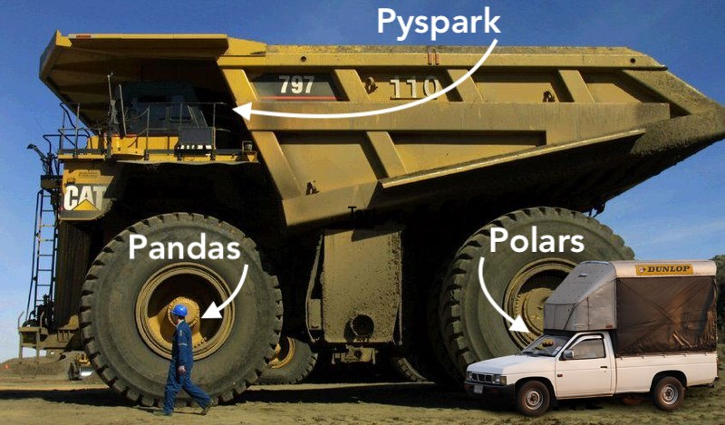

## Today

1. Small, medium, and big data
2. Parquet: how we store data on disk
3. Arrow: how we hold data in memory
4. Polars and PySpark
5. Challenge: data wrangling and visualization
6. Challenge: team proposal

# Small, medium, and big data

## What makes data "big"?

::: {.columns}
::: {.column width="33%"}
::: {.card}
[Volume]{.card-title}

Size on disk. If it fits and runs on your laptop, it isn't big. Today, **hundreds of GB** signals big.
:::
:::
::: {.column width="33%"}
::: {.card}
[Variety]{.card-title}

Many types of data: photos, video, spatial, time series, text. Each needs its own storage and retrieval.
:::
:::
::: {.column width="33%"}
::: {.card}
[Velocity]{.card-title}

How fast data arrives: sensors at thousands of readings a second, card transactions.
:::
:::
:::

Usually **two of the three** earn the word "big."

::: {.notes}
This course focuses on simplified volume and velocity: batch processing toward a predictive model, not streaming or real-time decisions.
:::

## Pick the right truck

{fig-align="center" height="480"}

## Small, medium, big

| | Small | Medium | Big |
|---|---|---|---|
| **Size** | Fits easily in memory | Up to tens of GB | Hundreds of GB and up |
| **Runs on** | Your laptop | One strong machine | A cluster |
| **Tool** | pandas | Polars (or DuckDB) | PySpark |
| **Vehicle** | Pickup truck | Pickup, driven well | Mining dump truck |

Our class data stays **under 1 TB** in total, with the largest tables around **100 GB**.

## Stay in the dump truck {.dark background-color="#022F4A"}

Some of our data will be small enough for Polars or pandas. You'll be tempted to switch.

<br>

[Don't. The point is to learn to drive the big truck. You'll need to drive it in industry.]{.orange style="font-size:1.2em"}

# Parquet: data on disk

## Rows or columns?

::: {.columns}
::: {.column width="50%"}
**Row-oriented** (CSV)

```text
placekey, region, visits
aaa,      UT,     120
bbb,      GA,     85
ccc,      UT,     240
```

To sum `visits`, you read **every value in every row**.
:::
::: {.column width="50%"}
**Column-oriented** (Parquet)

```text
placekey: aaa, bbb, ccc
region:   UT,  GA,  UT
visits:   120, 85,  240
```

To sum `visits`, you read **one column** and skip the rest.
:::
:::

## What Parquet gives you

- **Columnar:** read only the columns you need.
- **Compressed:** similar values sit together, so they compress well.
- **Typed schema:** numbers stay numbers. Nested lists and structs stay nested.
- **Statistics:** min and max per chunk let tools skip data a filter can't match.
- **Open standard:** Polars, pandas, DuckDB, Spark, R, and Databricks all read it.

## At scale

| Data | Size on S3 | Query time | Data scanned | Cost |
|---|---|---|---|---|
| CSV | 1 TB | 236 s | 1.15 TB | $5.75 |
| Parquet | 130 GB | 6.78 s | 2.51 GB | $0.01 |
| **Savings** | **87% smaller** | **34× faster** | **99% less** | **99.7% cheaper** |

[Source: [Databricks, "What is Parquet?"](https://databricks.com/glossary/what-is-parquet)]{.muted style="font-size:0.5em"}

## On your challenge data

::: {.columns}
::: {.column width="33%"}
::: {.card}
[81 MB]{.stat}
Three months of SafeGraph patterns as CSV
:::
:::
::: {.column width="33%"}
::: {.card}
[11.7 MB]{.stat}
The same patterns as Parquet, with nested columns kept typed
:::
:::
::: {.column width="33%"}
::: {.card}
[2 ms]{.stat}
To read 2 of 22 columns, vs. 143 ms for the whole file
:::
:::
:::

In CSV, nested fields like `popularity_by_hour` are JSON text you have to parse. In Parquet they're already lists.

::: {.notes}
Measured with Polars on a laptop. Timings vary by machine; the ratio is the point.
:::

# Arrow: data in memory

## Parquet on disk, Arrow in memory

::: {.columns}
::: {.column width="50%"}
::: {.card}
[Apache Parquet]{.card-title}

A **file format**. Compressed and encoded for storage. Built to be small and fast to scan.
:::
:::
::: {.column width="50%"}
::: {.card}
[Apache Arrow]{.card-title}

A **memory format**. Columnar and uncompressed. Built for fast computation.
:::
:::
:::

<br>

[**disk:** `.parquet` → **memory:** Arrow columns → Polars · pandas · DuckDB · Spark]{style="display:block;text-align:center"}

## Why Arrow matters

- **One shared layout.** Tools that speak Arrow can hand data to each other **without copying or converting** it.
- **Polars is built on Arrow.** Its DataFrames are Arrow columns.
- **Spark uses Arrow** to move data to and from pandas (`toPandas()`, pandas UDFs).
- **Columnar in memory** means fast operations on whole columns at once.

::: {.takeaway}
**Parquet is how data rests. Arrow is how data moves and gets computed.**
:::

# Polars and PySpark

## The same question in both

Total visits to religious buildings by state:

::: {.panel-tabset}
### Polars

```python
import polars as pl

places = pl.scan_parquet("places.parquet")
patterns = pl.scan_parquet("patterns.parquet")

(places
    .filter(pl.col("top_category") == "Religious Organizations")
    .join(patterns, on="placekey")
    .group_by("region")
    .agg(pl.col("raw_visit_counts").sum().alias("visits"))
    .collect())
```

### PySpark

```python
from pyspark.sql import functions as F

places = spark.read.parquet("places.parquet")
patterns = spark.read.parquet("patterns.parquet")

(places
    .filter(F.col("top_category") == "Religious Organizations")
    .join(patterns, on="placekey")
    .groupBy("region")
    .agg(F.sum("raw_visit_counts").alias("visits"))
    .show())
```
:::

Both return **GA: 4,476,806** and **UT: 1,157,708** on the challenge data.

## Both are lazy

Nothing runs until you ask for a result (`.collect()` in Polars, `.show()` in Spark). First, the tool **plans the query**:

```text
Parquet SCAN [places.parquet]
  PROJECT 3/25 COLUMNS
  SELECTION: col("top_category") == "Religious Organizations"
Parquet SCAN [patterns.parquet]
  PROJECT 2/22 COLUMNS
```

The planner read **5 of 47 columns** and filtered while scanning. That's Parquet and a lazy engine working together.

## When to use which

::: {.columns}
::: {.column width="50%"}
::: {.card}
[Polars]{.card-title}

- One machine, many cores
- Very fast on medium data
- Built on Arrow
- Our first challenge
:::
:::
::: {.column width="50%"}
::: {.card}
[PySpark]{.card-title}

- A cluster of machines
- Scales past one computer's memory
- Runs on Databricks
- Most of the semester
:::
:::
:::

The APIs are close. **What you learn in Polars carries over to PySpark.**

# Challenge: wrangling and visualization

## The challenge

Compare **church buildings in Utah and Georgia** using SafeGraph foot-traffic data.

- **Tools:** Polars and Plotly Express
- **Answer at least 3 of 4 questions**, for example:
  - iPhone vs. Android visitors to Latter-day Saint buildings in each state
  - Hourly patterns of Latter-day Saint vs. other churches
  - Brands visited the same day by each group
- **Due:**  · [Challenge repository]()

## The data

| Folder | What it is | Use it for |
|---|---|---|
| `csv` | Raw SafeGraph files | Exploring |
| `parquet_derived` | Nested fields split into their own tables | Exploring |
| `parquet` | Close to the raw structure; matches Databricks | **Your final code** |

Your final code must run on the `parquet` folder.

## What each answer needs

::: {.columns}
::: {.column width="25%"}
::: {.card}
[1]{.stat}
Code for the wrangling and the chart
:::
:::
::: {.column width="25%"}
::: {.card}
[2]{.stat}
A visualization
:::
:::
::: {.column width="25%"}
::: {.card}
[3]{.stat}
The first five rows of the data you charted
:::
:::
::: {.column width="25%"}
::: {.card}
[4]{.stat}
A few sentences on the insight
:::
:::
:::

> It is a report, not a vomit of code with poorly developed visuals.

## How to work and submit

::: {.columns}
::: {.column width="50%"}
**Rules**

- Talk with your group, but **don't look at each other's code.**
- Submit a short `.pdf` or `.html` report plus the `.py` script.

**Environment:** `marimo edit`, or `docker compose up` and open `localhost:8080`.
:::
::: {.column width="50%"}
**GitHub**

1. Fork the challenge repository.
2. Add a folder `LASTNAME_FIRSTINITIAL` with the files from `hathaway_J`.
3. Open a pull request.

**Canvas:** upload your `.pdf` or `.html`.
:::
:::

# Challenge: team proposal

## The goal

Data-as-a-Service (DaaS) companies sell rich, detailed data about places and time.

**Your team proposes a data product:** a predictive model that non-technical employees can use, built from DaaS data through [Dewey](https://app.deweydata.io/) and the [US Census API](https://www.census.gov/data/developers/guidance/api-user-guide.html).

[Challenge repository]()

## Requirements

- **PDI C-Stores** (convenience store data) is the driving dataset.
- Don't target one brand or company.
- The model outputs a **probability** (classification) or a **count** (regression).
- Define a clear **place** (a county or city), **time span** (last year by month), **unit of analysis**, and **client** (a county government, donut shops).
- Explain how you'll use the **Census API**.
- [Extra weight for adding data beyond one Dewey provider.]{.orange}

## Statement of work

No more than **two pages or 5 to 8 slides**, with:

1. Team member names and majors
2. The business need and why it's valuable
3. The data format, with some descriptive visuals
4. How you'll use ML/AI in the application
5. What counts as a successful product

**Submit:** each team forks the repository and adds a `TEAMNAME` folder. Each student uploads the `.pdf` or `.html` to Canvas. **Due:** 

## Remember from day 1

This proposal is a **decision-point presentation**. The class will pick an approach.

- **Make your point early**, then justify it.
- **Know your data source** well enough to answer almost any question about it.
- Practice the **five whys** before you present.

## This week

- Fork the [wrangling challenge]() and get marimo or Docker running.
- Load `places.parquet` and `patterns.parquet` with Polars.
- Form your team and start talking about a business need.

## Discuss {.dark background-color="#022F4A"}

**Who would pay for a prediction made from convenience-store data?**

<br>

[Name a client, a place, and a unit of analysis.]{.orange}
