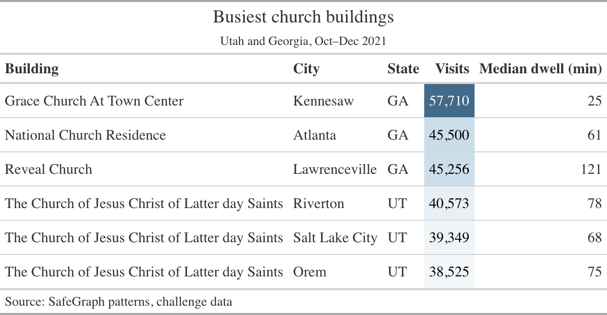
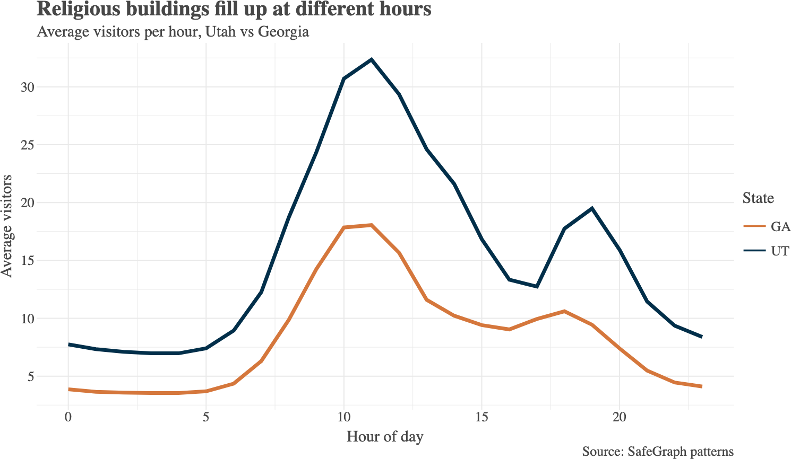

## Today

1. What makes a chart worth showing
2. One of your charts, on the screen
3. Tables vs. charts
4. Canvas: are the due dates right?
5. The project proposal challenge
6. Team time

# Charts that make a point

## What makes a chart worth showing

- **One point per chart.** If you can't say it in a sentence, it isn't done.
- **Put the point in the title.** "Religious buildings fill up at different hours" beats "Visits by hour."
- **Order on purpose.** Sort by value, not alphabetically.
- **Label the axes** in a client's words, with units.
- **Cut what carries no meaning:** heavy gridlines, needless legends, unread decimals.

::: {.takeaway}
**The chart is the argument.** A weak visual weakens it.
:::

## The challenge questions

Compare church buildings in **Utah** and **Georgia**. Answer at least **three**:

1. **iPhone vs. Android** visitors to Latter-day Saint buildings in each state
2. **Hourly patterns**, Latter-day Saint vs. other churches
3. `related_same_day_brand` for each group
4. A reach: `related_same_day_brand` for **temples, seminaries, and meetinghouses**

Each answer: code, a visualization, the first five rows charted, and a few sentences of insight.

## Let's see one of yours {.dark background-color="#022F4A"}

**Who will put a chart on the screen?**

 

[Tell us the question, then the point your chart makes. We'll talk about what the chart does well and what would make the point land harder.]{.orange}

::: {.notes}
Ask the room: what is the point? Can you see it in under five seconds? What would you cut?
:::

# Tables vs. charts

## When a table wins

::: {.columns}
::: {.column width="50%"}
::: {.card}
[Use a chart]{.card-title}

- A shape, trend, or comparison
- Many values at once
- "Which is bigger" at a glance
:::
:::
::: {.column width="50%"}
::: {.card}
[Use a table]{.card-title}

- Exact numbers matter
- A handful of rows
- Several different units side by side
- People will look up a specific row
:::
:::
:::

A table is a visual too. **It deserves the same care**: aligned numbers, real labels, a title that says the point.

## Great Tables

{fig-align="center" width="78%"}

[Made with [Great Tables](https://posit-dev.github.io/great-tables/) (`pip install great-tables`), which works directly with Polars.]{.muted style="font-size:0.55em"}

## Lets-Plot

{fig-align="center" width="72%"}

[Made with [Lets-Plot](https://lets-plot.org/) (`pip install lets-plot`), a grammar-of-graphics library like ggplot2.]{.muted style="font-size:0.55em"}

## Your toolbox

| Package | Good for |
|---|---|
| [Plotly Express](https://plotly.com/python/plotly-express/) | Quick interactive charts. **Required for this challenge.** |
| [Lets-Plot](https://lets-plot.org/) | Grammar of graphics, close to ggplot2 |
| [Great Tables](https://posit-dev.github.io/great-tables/) | Presentation-ready tables from Polars |

Both example figures on the last two slides came from **your challenge data**. The script is in [`img/example_figures.py`](img/example_figures.py).

# Dates and the proposal

## Canvas check

Let's open [Canvas]() together and compare it to the [class repository]().

- Is the **wrangling and visualization challenge** date right?
- Is **Learning Plan 1** there, and when?
- Is the **project proposal** date right?
- Anything listed that we haven't talked about?

[Tell me now if a date is wrong. Fixing it later costs you more than it costs me.]{.orange}

## The proposal, again

Due ****. [Challenge repository]()

- **PDI C-Stores** is the driving dataset; don't target one brand.
- The model outputs a **probability** or a **count**.
- Name a **client**, **place**, **time span**, and **unit of analysis**.
- Say how you'll use the **Census API**.
- Two pages or 5 to 8 slides.

::: {.takeaway}
**This is a decision-point presentation.** Make your point early, then justify it.
:::

## Team time {.dark background-color="#022F4A"}

**Work on the proposal. I'll come around.**

 

[Come find me with: your client, your unit of analysis, and the one chart you'd show them first.]{.orange}
