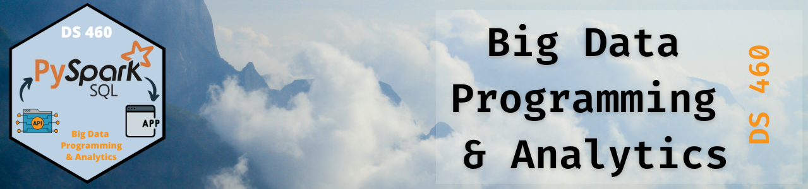

{fig-alt="DS 460 Big Data Programming and Analytics banner"}

## Class decks

::: {#decks}
:::

Press `s` in a deck for speaker view, `f` for full screen, and `Esc` for a slide overview.

## Reference

- [Course book](https://byuibigdata.github.io/bdbook/)
- [Course guide and syllabus](https://github.com/byuibigdata/course_guide)
